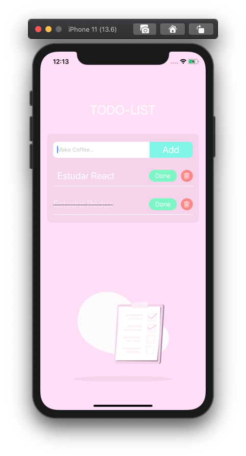

# todo-list
To do list criado com intuito de estudar Redux e duck pattern.<br/>
Layout criado em <a href="https://www.adobe.com/br/products/xd.html"> Adobe XD </a> arquivo na pasta assets.

  

1- Baixar dependências: 
```javascript
 yarn
```

2- Executar APP:
```javascript
   yarn ios
```

Tecnologias utilizadas : 
  <ul>
    <li><a href="https://redux.js.org/api/api-reference"> Redux </a></li>
    <li><a href="https://styled-components.com/docs"> Styled Components </a></li>
  </ul>
